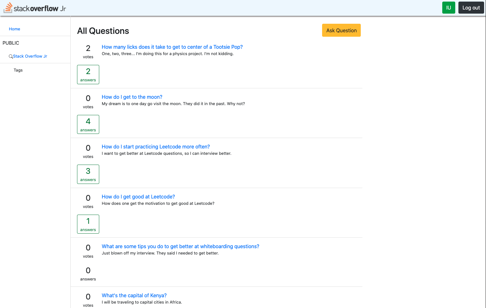
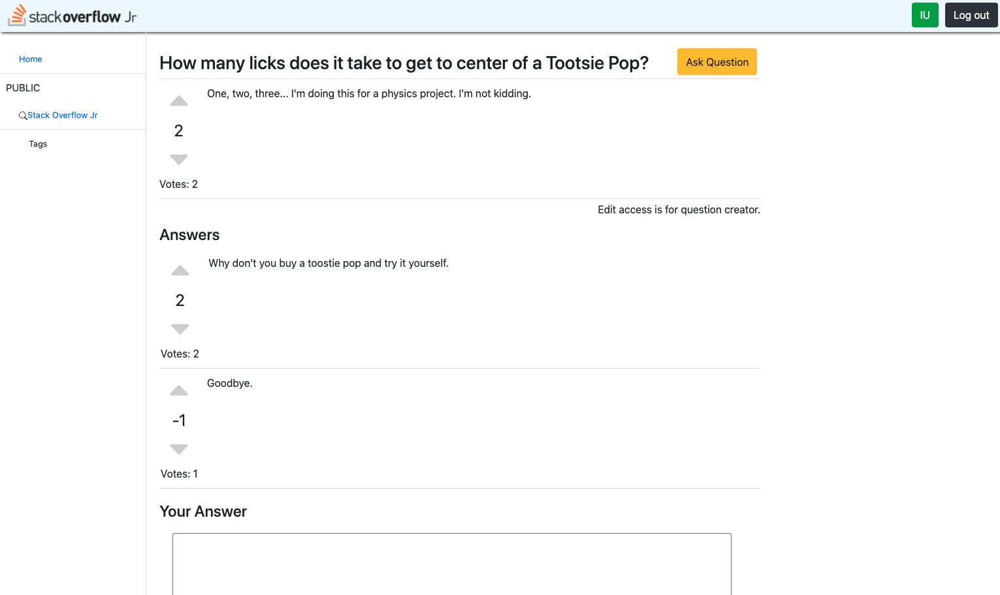

# StackOverflowJR

## Description

StackOverflowJR is a software engineering social networking application. Coders can ask and answer coding questions. Users can upvote and downvote questions. Also, not only can you learn from other coders, but you can also meet them as well.

[Live Demo](https://stackoverflow-jr.herokuapp.com/#/)

Main splash page

List of questions

Details of a question

## Technologies

**Frontend**
* React
* Redux
* SCSS
* HTML
* JavaScript

**Backend**
* Rails
* Ruby
* PostgreSQL
* AJAX

**Hosting**
* Heroku

## Features

### Questions

Users can...
* create questions
* answer questions
* edit questions

### Answers

Users can....
* create answers
* edit answers
* delete answers

